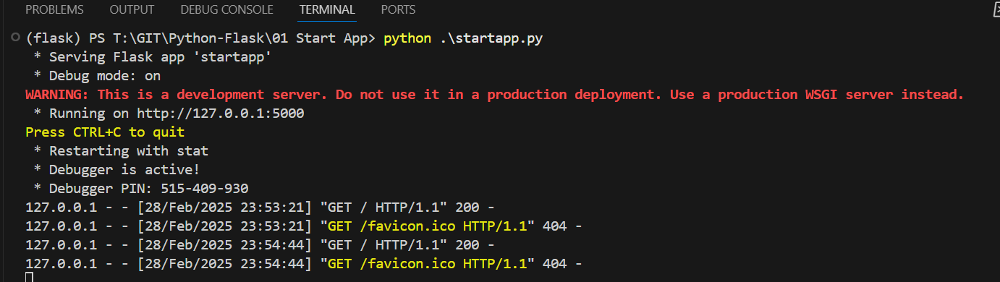
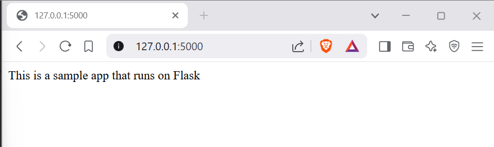

Execute One

```py
from flask import Flask

app = Flask(__name__)

@app.route("/")
def simpleApp():
    return "This is a sample app that runs on Flask"

if (__name__ =="__main__"):
    app.run(debug=True)
```

Outcome


